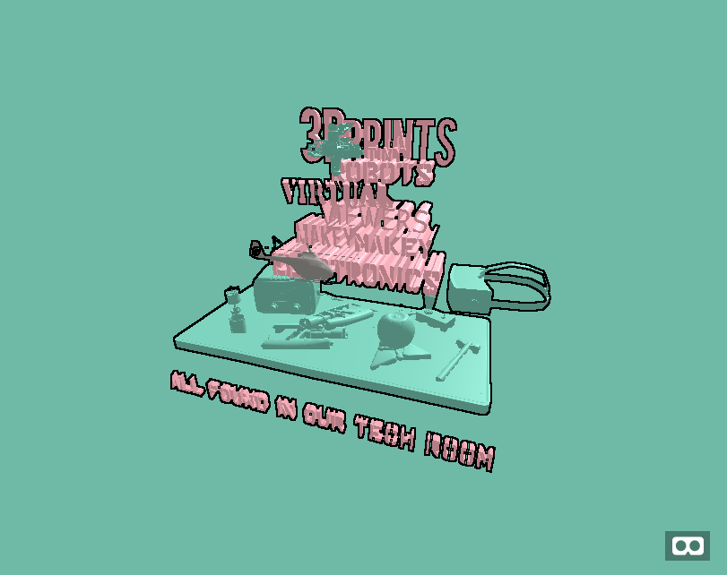

# Tech Room Poster

A simple 3D orbiting poster made using assets from google poy and sketchfab.


## Work

I currently work in the tech room of the (idea lab)[https://www.macalester.edu/entrepreneurship/idealab/#/0] at Macalester College and my work involves encouraging students to take
advantage of the different tech based devices we have (like 3D printers, VR headsets, Raspberry Pi and electronic components)
To improve their projects and even learn some new skills.

## Working with VR

Of late, we have been trying different projects to incorporate VR and AR into the idea lab. Hence, I have been working with Aframe to see how it can be 
used to create virtual rooms, virtual posters and workshop areas that can be hangout rooms for students.

## Prerequisites

**Aframe**

(Aframe)[https://aframe.io/] is a simple javascript library designed to allow you to make amazing web VR experiences using 
few lines of HTML.

Below is the basic example and what it produces

```
<html>
  <head>
    <script src="https://aframe.io/releases/0.9.1/aframe.min.js"></script>
  </head>
  <body>
    <a-scene>
      <a-box position="-1 0.5 -3" rotation="0 45 0" color="#4CC3D9"></a-box>
      <a-sphere position="0 1.25 -5" radius="1.25" color="#EF2D5E"></a-sphere>
      <a-cylinder position="1 0.75 -3" radius="0.5" height="1.5" color="#FFC65D"></a-cylinder>
      <a-plane position="0 0 -4" rotation="-90 0 0" width="4" height="4" color="#7BC8A4"></a-plane>
      <a-sky color="#ECECEC"></a-sky>
    </a-scene>
  </body>
</html>
```


## Final Product

After inserting other scripts, adding post processing, adding and placing models and animations, the (final product)[https://enter-tech-room.glitch.me/] is as shown below.


## Acknolwedgements

Many Thanks to the following artists for their 3D models.

* (antonmoek)[https://sketchfab.com/3d-models/low-poly-helicopter-5bbed2de9baa4a13a7faa72653b78b64]
* (Alan Zimmerman)[https://poly.google.com/view/emG0dq38D8f]
* (Poly by Google)[https://poly.google.com/view/bvd33G7Q66m]
